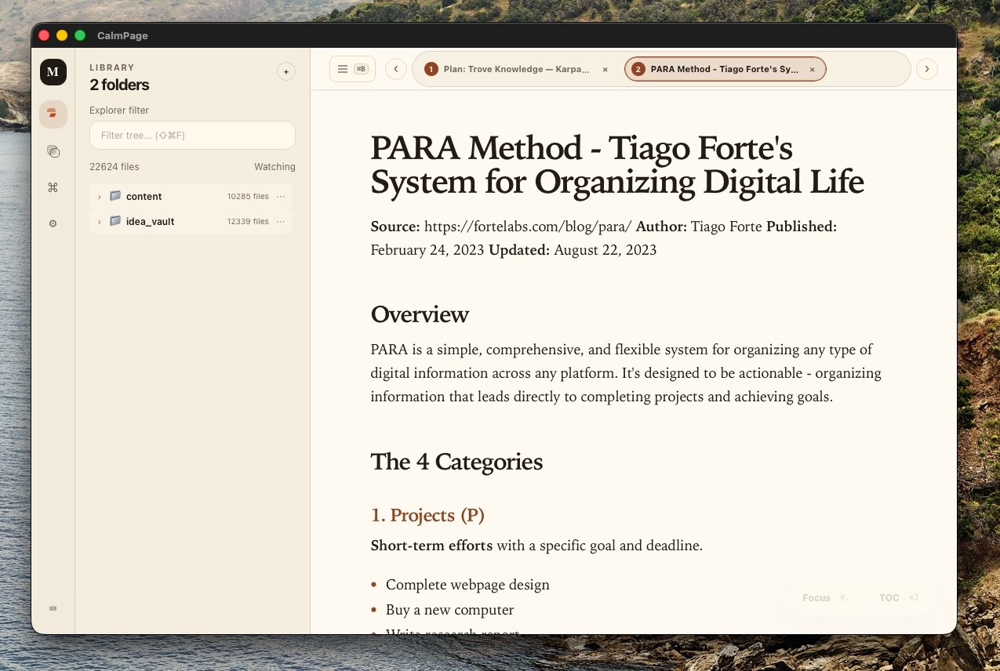
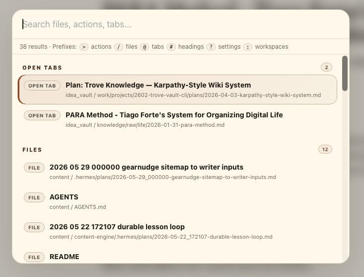
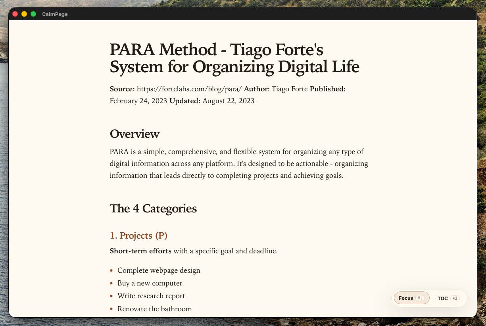

# CalmPage

CalmPage is a native macOS Markdown reader and viewer for local files, folders, tabs, workspaces, and focus reading.

It exists because AI creates a lot of Markdown, but most apps make it hard to read.

Many apps are good at either reading or file management, but not both.
CalmPage is built to solve that gap:

- make Markdown easy to read
- keep folder and file management simple
- support fast keyboard navigation
- make long notes feel calm instead of noisy







It is made for people who want:

- a clean Markdown reader instead of a full editor
- fast access to local Markdown folders and notes
- tabs for opening multiple files at once
- workspaces for grouping different folder sets
- focus mode, table of contents, and keyboard shortcuts

## What CalmPage does

- Open one or many Markdown folders
- Browse Markdown files in a clean library view
- Open several files in tabs
- Use focus mode for distraction-free reading
- Show a table of contents for long documents
- Use the command palette to jump to files, tabs, headings, actions, settings, and workspaces
- Customize reading style, colors, spacing, and Markdown rendering

## What CalmPage is for

CalmPage is for reading Markdown, not writing it.

Use it when you want:

- quick access to a vault of Markdown notes
- a simple way to jump between files
- a better reading view for long documents
- a Markdown viewer that feels lighter than a full editor

## Quick Start

1. Open CalmPage.
2. Add a folder from the left Library panel.
3. Click a Markdown file to open it.
4. Use tabs to keep multiple files open.
5. Use Focus mode when you want a cleaner reading view.

## Keyboard Guide

Most important shortcuts:

- `Cmd+K` open command palette
- `Cmd+P` search files
- `Cmd+B` toggle left sidebar
- `Cmd+J` toggle table of contents
- `Cmd+.` toggle focus mode
- `Cmd+[` and `Cmd+]` move between tabs
- `Cmd+W` close the current tab
- `Cmd+F` search inside the current note
- `Cmd+,` open settings

If you forget a shortcut, press `?` to open the shortcut help panel.

## Library, Workspaces, and Tabs

### Library

The Library shows the folders you added and the Markdown files inside them.

- Use `+` to add a folder
- Right-click a folder to remove it or copy its path
- Search in the Library to filter files quickly

### Workspaces

Workspaces are saved sets of folders.

Use them when you want separate reading contexts, for example:

- personal notes
- work docs
- research folders
- writing projects

You can create, rename, switch, duplicate, and delete workspaces.

### Tabs

CalmPage can keep multiple Markdown files open at the same time.

This is useful when you want to compare files or move back and forth without losing your place.

## Focus Mode

Focus mode is for reading one Markdown document with fewer distractions.

It keeps the page quiet and lets you use:

- `Cmd+J` for table of contents
- `/` to search headings in focus mode
- arrow keys or `J` / `K` to move through content

## Settings

CalmPage has a reading and rendering settings area where you can tune:

- theme
- font size
- line height
- text width
- heading scale
- Markdown element styling

The goal is to let you shape the Markdown reading experience to match your own taste.

## Supported files

CalmPage scans common Markdown files, including:

- `.md`
- `.markdown`
- `.mdx`

## Development

```sh
npm install
npm run check
cargo check --manifest-path src-tauri/Cargo.toml
npm run tauri dev
```

## Build

```sh
npm run build
npm run tauri build
```

Build artifacts are written under:

```text
src-tauri/target/release/bundle/
```

## Project Docs

- [Requirements and plan](docs/requirements-and-plan.md)
- [Reading UI/UX redesign brief](docs/reading-ui-ux-redesign-brief.md)
- [Reader architecture plan](docs/reader-architecture-plan.md)
- [Workspace and command palette progress](docs/workspace-command-ui-progress.md)
- [Releases](docs/releases/README.md)
